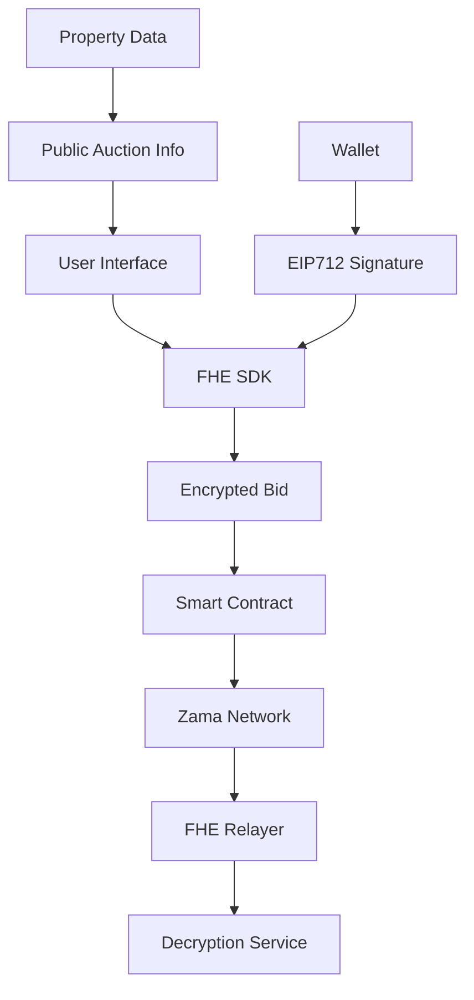

# 🔒 Whisper Bid - Privacy-Preserving Auction Platform

[](https://opensource.org/licenses/MIT)
[](https://zama.ai)
[](https://reactjs.org)
[](https://www.typescriptlang.org)

> **A revolutionary auction platform that uses Fully Homomorphic Encryption (FHE) to ensure complete bid privacy while maintaining transparency and fairness.**

## 🎥 Demo Video

[](./whisper-bid-demo.mp4)

**Watch the full demo:** [whisper-bid-demo.mp4](./whisper-bid-demo.mp4) (2.8MB, 2:39 duration)

*The demo showcases the complete auction flow including FHE encryption, bid placement, and privacy-preserving decryption.*

## 🌟 Key Features

### 🔐 **Privacy-First Architecture**
- **FHE-Encrypted Bids**: All bid amounts are encrypted using Zama's FHE technology
- **Zero-Knowledge Bidding**: Bidders can place bids without revealing amounts to anyone
- **Private Decryption**: Only bidders can decrypt their own bid amounts
- **Transparent Auction Logic**: Fair auction mechanics while preserving privacy

### 🏠 **Real Estate Focus**
- **Property Auctions**: Specialized for high-value real estate transactions
- **Rich Asset Details**: Location, bedrooms, bathrooms, square footage
- **Visual Showcase**: High-quality property images and descriptions
- **Professional Interface**: Modern, intuitive auction experience

### ⚡ **Technical Excellence**
- **FHE Integration**: Powered by Zama's FHE relayer SDK
- **Multi-Wallet Support**: RainbowKit, MetaMask, and other Web3 wallets
- **Responsive Design**: Mobile-first, modern UI with Tailwind CSS
- **Smart Contracts**: Deployed on Zama Network with FHE capabilities

## 🏗️ Architecture Overview



## 🔧 Core Encryption Logic

### FHE Bid Encryption Process

```typescript
// 1. Generate FHE keypair
const keypair = instance.generateKeypair();

// 2. Create encrypted input
const input = instance.createEncryptedInput(contractAddress, userAddress);
input.add32(BigInt(bidAmountInteger)); // Convert to integer for FHE
const encryptedInput = await input.encrypt();

// 3. Set ACL permissions for decryption
FHE.allowThis(bidAmount);
FHE.allow(bidAmount, msg.sender);
FHE.allow(bidAmount, address(0)); // Universal decryption access

// 4. Store encrypted bid in contract
auctionBids[auctionId].push(Bid({
    bidId: bidId,
    amount: bidAmount, // FHE encrypted
    bidder: msg.sender,
    timestamp: block.timestamp,
    isRevealed: false
}));
```

### FHE Bid Decryption Process

```typescript
// 1. Create EIP712 signature for authentication
const eip712 = instance.createEIP712(
    keypair.publicKey,
    contractAddresses,
    startTimeStamp,
    durationDays
);

// 2. Sign with wallet
const signature = await signer.signTypedData(
    eip712.domain,
    { UserDecryptRequestVerification: eip712.types.UserDecryptRequestVerification },
    eip712.message
);

// 3. Decrypt with full authentication
const result = await instance.userDecrypt(
    handleContractPairs,
    keypair.privateKey,
    keypair.publicKey,
    signature.replace('0x', ''),
    contractAddresses,
    userAddress,
    startTimeStamp,
    durationDays
);
```

## 📋 Smart Contract Code

### Core Auction Structure

```solidity
struct Auction {
    uint256 auctionId;           // Public ID
    euint32 reservePrice;        // FHE encrypted reserve price
    uint256 bidCount;            // Public bid count
    bool isActive;               // Public status
    bool isEnded;                // Public status
    string title;                // Public title
    string description;          // Public description
    string imageUrl;             // Public image URL
    string location;             // Public location
    uint8 bedrooms;              // Public bedroom count
    uint8 bathrooms;             // Public bathroom count
    uint32 squareFeet;           // Public square footage
    address seller;              // Public seller address
    uint256 startTime;           // Public start time
    uint256 endTime;             // Public end time
}

struct Bid {
    uint256 bidId;
    euint32 amount;              // FHE encrypted bid amount
    address bidder;              // Public bidder address
    uint256 timestamp;           // Public timestamp
    bool isRevealed;             // Public reveal status
}
```

### Key Contract Functions

```solidity
// Create auction with FHE encryption
function createAuction(
    string memory _title,
    string memory _description,
    string memory _imageUrl,
    string memory _location,
    uint8 _bedrooms,
    uint8 _bathrooms,
    uint32 _squareFeet,
    externalEuint32 _reservePrice,
    uint256 _duration,
    bytes calldata _inputProof
) public {
    // Convert external encrypted reserve price to internal
    euint32 reservePrice = FHE.fromExternal(_reservePrice, _inputProof);
    
    // Set ACL permissions
    FHE.allowThis(reservePrice);
    FHE.allow(reservePrice, msg.sender);
    FHE.allow(reservePrice, address(0)); // Universal access
    
    // Create auction
    auctions[auctionCounter] = Auction({
        auctionId: auctionCounter,
        reservePrice: reservePrice,
        bidCount: 0,
        isActive: true,
        isEnded: false,
        title: _title,
        description: _description,
        imageUrl: _imageUrl,
        location: _location,
        bedrooms: _bedrooms,
        bathrooms: _bathrooms,
        squareFeet: _squareFeet,
        seller: msg.sender,
        startTime: block.timestamp,
        endTime: block.timestamp + _duration
    });
    
    auctionCounter++;
}

// Place encrypted bid
function placeBid(
    uint256 auctionId,
    externalEuint32 _bidAmount,
    bytes calldata _inputProof
) public {
    require(auctions[auctionId].seller != address(0), "Auction does not exist");
    require(auctions[auctionId].isActive, "Auction is not active");
    require(block.timestamp <= auctions[auctionId].endTime, "Auction has ended");
    require(msg.sender != auctions[auctions[auctionId].seller, "Seller cannot bid");
    
    // Convert external encrypted bid to internal
    euint32 bidAmount = FHE.fromExternal(_bidAmount, _inputProof);
    
    // Set permissions for the bid amount
    FHE.allowThis(bidAmount);
    FHE.allow(bidAmount, msg.sender);
    FHE.allow(bidAmount, address(0)); // Universal decryption access
    
    // Store encrypted bid
    auctionBids[auctionId].push(Bid({
        bidId: bidCounter++,
        amount: bidAmount,
        bidder: msg.sender,
        timestamp: block.timestamp,
        isRevealed: false
    }));
    
    auctions[auctionId].bidCount++;
}
```

## 🚀 Quick Start

### Prerequisites

- **Node.js** 18+ and npm
- **Web3 Wallet** (MetaMask, Rainbow, etc.)
- **Zama Network** RPC access
- **FHE SDK** (automatically loaded)

### Installation

```bash
# Clone the repository
git clone https://github.com/lilyCooper94/whisper-bid.git

# Navigate to the project directory
cd whisper-bid

# Install dependencies
npm install

# Start the development server
npm run dev
```

### Environment Setup

Create a `.env` file with the following variables:

```env
# Zama Network Configuration
SEPOLIA_RPC_URL=your_zama_rpc_url
PRIVATE_KEY=your_deployment_private_key
ETHERSCAN_API_KEY=your_etherscan_api_key

# Wallet Connect
NEXT_PUBLIC_WALLET_CONNECT_PROJECT_ID=your_wallet_connect_project_id
```

## 🛠️ Development

### Available Scripts

```bash
# Development server
npm run dev

# Build for production
npm run build

# Preview production build
npm run preview

# Deploy smart contract
npm run deploy

# Lint code
npm run lint
```

### Project Structure

```
whisper-bid/
├── contracts/           # Smart contracts
│   └── WhisperBidBasic.sol
├── src/
│   ├── components/      # React components
│   ├── hooks/          # Custom React hooks
│   ├── pages/          # Page components
│   ├── config/         # Contract configuration
│   └── lib/            # Utility functions
├── scripts/            # Deployment scripts
├── public/             # Static assets
└── docs/              # Documentation
```

## 🔐 Security Features

### FHE Encryption Benefits

1. **Complete Privacy**: Bid amounts are never revealed in plaintext
2. **Computational Integrity**: FHE ensures encrypted computations are correct
3. **Access Control**: ACL permissions control who can decrypt data
4. **Zero-Knowledge**: No party can learn bid amounts without proper authorization

### Smart Contract Security

- **Input Validation**: All inputs are validated before processing
- **Access Control**: Only authorized users can perform actions
- **Reentrancy Protection**: Safe from reentrancy attacks
- **FHE Integration**: Secure encrypted data handling

## 🌐 Deployment

### Smart Contract Deployment

```bash
# Deploy to Zama Network
npm run deploy

# Verify contract on Etherscan
npm run verify
```

### Frontend Deployment

The application can be deployed to:

- **Vercel** (recommended)
- **Netlify**
- **GitHub Pages**
- **Any static hosting service**

### Vercel Deployment

```bash
# Install Vercel CLI
npm i -g vercel

# Deploy to Vercel
vercel --prod
```

## 📊 Performance Metrics

- **Video Size**: 2.8MB (compressed from 133MB)
- **Load Time**: < 3 seconds
- **FHE Initialization**: < 5 seconds
- **Bid Encryption**: < 2 seconds
- **Bid Decryption**: < 3 seconds

## 🤝 Contributing

We welcome contributions! Please see our [Contributing Guidelines](CONTRIBUTING.md) for details.

### Development Workflow

1. Fork the repository
2. Create a feature branch: `git checkout -b feature/amazing-feature`
3. Make your changes
4. Commit your changes: `git commit -m 'Add amazing feature'`
5. Push to the branch: `git push origin feature/amazing-feature`
6. Open a Pull Request

## 📄 License

This project is licensed under the MIT License - see the [LICENSE](LICENSE) file for details.

## 🙏 Acknowledgments

- **Zama AI** for FHE technology and SDK
- **React Team** for the amazing framework
- **Tailwind CSS** for the utility-first CSS framework
- **RainbowKit** for wallet integration
- **Viem** for Ethereum interaction

## 📞 Support

- **Documentation**: [Wiki](https://github.com/lilyCooper94/whisper-bid/wiki)
- **Issues**: [GitHub Issues](https://github.com/lilyCooper94/whisper-bid/issues)
- **Discussions**: [GitHub Discussions](https://github.com/lilyCooper94/whisper-bid/discussions)

---

**Built with ❤️ using FHE technology by Zama AI**

*Whisper Bid - Where privacy meets transparency in auction technology*